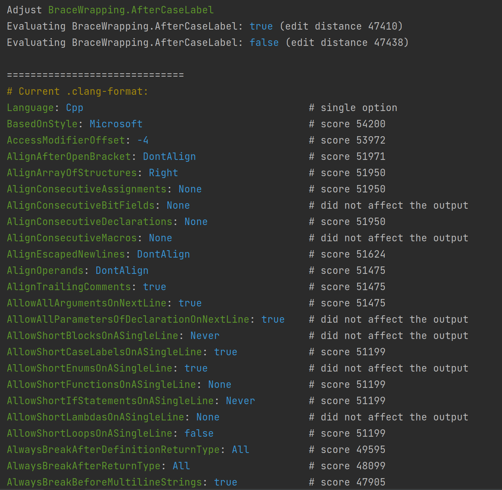

# clang-unformat

> A simple tool to infer a .clang-format file from existing code 



## Getting started

Build:

```shell
git clone https://www.github.com/alandefreitas/clang-unformat
cd clang-unformat
mkdir build
cmake -DCMAKE_BUILD_TYPE=Release -DCMAKE_CXX_FLAGS=-O3 ..
cmake --build . --target clang-unformat
```

Run:

```shell
clang-unformat --input /path/to/source/files
```

## Options

```shell
clang-unformat --help
```

```console
clang-unformat:
  --help                       produce help message
  --input arg                  input directory with source files
  --output arg                 output path for the clang-format file
  --temp arg                   temporary directory to formatted source files
  --clang-format arg           path to the clang-format executable
  --parallel arg               number of threads
  --require-influence arg      only include parameters that influence the 
                               output
  --extensions arg             file extensions to format
```

## Sample output

```yaml
Language: Cpp                                      # single option
BasedOnStyle: Microsoft                            # edit distance 54200
AccessModifierOffset: -4                           # edit distance 53972
AlignAfterOpenBracket: DontAlign                   # edit distance 51971
AlignArrayOfStructures: Right                      # edit distance 51950
AlignConsecutiveAssignments: None                  # edit distance 51950
AlignConsecutiveBitFields: None                    # inherited from prefix Align
AlignConsecutiveDeclarations: None                 # edit distance 51950
AlignConsecutiveMacros: None                       # inherited from prefix Align
AlignEscapedNewlines: DontAlign                    # edit distance 51624
AlignOperands: DontAlign                           # edit distance 51475
AlignTrailingComments: true                        # edit distance 51475
AllowAllArgumentsOnNextLine: true                  # edit distance 51475
AllowAllParametersOfDeclarationOnNextLine: true    # did not affect the output
AllowShortBlocksOnASingleLine: Never               # Using default value Never
AllowShortCaseLabelsOnASingleLine: true            # edit distance 51199
AllowShortEnumsOnASingleLine: true                 # did not affect the output
AllowShortFunctionsOnASingleLine: None             # edit distance 51199
AllowShortIfStatementsOnASingleLine: Never         # edit distance 51199
AllowShortLambdasOnASingleLine: None               # Using default value None
AllowShortLoopsOnASingleLine: false                # edit distance 51199
AlwaysBreakAfterDefinitionReturnType: All          # edit distance 49595
AlwaysBreakAfterReturnType: All                    # edit distance 48099
AlwaysBreakBeforeMultilineStrings: true            # edit distance 47905
AlwaysBreakTemplateDeclarations: Yes               # edit distance 47786
BinPackArguments: false                            # edit distance 47771
BinPackParameters: false                           # edit distance 47439
BitFieldColonSpacing: After                        # edit distance 47438
BreakBeforeBraces: Custom                          # edit distance 47406
BraceWrapping:
  AfterCaseLabel: true                             # edit distance 47410
  AfterClass: true                                 # edit distance 47410
  AfterControlStatement: Always                    # edit distance 47410
  AfterEnum: true                                  # edit distance 47410
  AfterFunction: true                              # edit distance 47410
  AfterNamespace: false                            # edit distance 47095
  AfterObjCDeclaration: true                       # inherited from prefix BraceWrapping
  AfterStruct: true                                # edit distance 47095
  AfterUnion: true                                 # inherited from prefix BraceWrapping
  AfterExternBlock: true                           # inherited from prefix BraceWrapping
  BeforeCatch: true                                # inherited from prefix BraceWrapping
  BeforeElse: true                                 # edit distance 47095
  BeforeLambdaBody: true                           # edit distance 47091
  BeforeWhile: true                                # inherited from prefix BraceWrapping
  IndentBraces: false                              # edit distance 47091
  SplitEmptyFunction: true                         # edit distance 47091
  SplitEmptyRecord: true                           # edit distance 47091
  SplitEmptyNamespace: true                        # inherited from prefix BraceWrapping
BreakAfterJavaFieldAnnotations: true               # did not affect the output
BreakBeforeBinaryOperators: None                   # edit distance 47091
BreakBeforeConceptDeclarations: false              # inherited from prefix BreakBefore
BreakBeforeTernaryOperators: false                 # edit distance 47086
BreakConstructorInitializers: BeforeComma          # edit distance 46206
BreakInheritanceList: BeforeComma                  # edit distance 46170
BreakStringLiterals: true                          # did not affect the output
ColumnLimit: 80                                    # edit distance 43272
CompactNamespaces: true                            # edit distance 42928
ConstructorInitializerIndentWidth: 4               # edit distance 42928
ContinuationIndentWidth: 4                         # edit distance 42928
Cpp11BracedListStyle: false                        # edit distance 42870
DeriveLineEnding: true                             # inherited from prefix Derive
DerivePointerAlignment: true                       # edit distance 40433
EmptyLineAfterAccessModifier: Leave                # edit distance 40422
EmptyLineBeforeAccessModifier: Leave               # edit distance 40411
ExperimentalAutoDetectBinPacking: true             # did not affect the output
FixNamespaceComments: false                        # edit distance 37705
IncludeBlocks: Preserve                            # edit distance 37705
IndentAccessModifiers: false                       # edit distance 37705
IndentCaseBlocks: false                            # edit distance 37705
IndentCaseLabels: false                            # edit distance 37705
IndentExternBlock: AfterExternBlock                # did not affect the output
IndentGotoLabels: true                             # edit distance 37705
IndentPPDirectives: None                           # edit distance 37705
IndentRequires: false                              # inherited from prefix Indent
IndentWidth: 4                                     # edit distance 37705
IndentWrappedFunctionNames: false                  # edit distance 37705
InsertTrailingCommas: None                         # did not affect the output
KeepEmptyLinesAtTheStartOfBlocks: true             # did not affect the output
LambdaBodyIndentation: OuterScope                  # edit distance 37697
MaxEmptyLinesToKeep: 2                             # edit distance 37689
NamespaceIndentation: None                         # edit distance 37689
PenaltyBreakAssignment: 512                        # edit distance 37593
PenaltyBreakBeforeFirstCallParameter: 512          # inherited from prefix PenaltyBreak
PenaltyBreakComment: 512                           # inherited from prefix PenaltyBreak
PenaltyBreakFirstLessLess: 512                     # inherited from prefix PenaltyBreak
PenaltyBreakString: 512                            # inherited from prefix PenaltyBreak
PenaltyBreakTemplateDeclaration: 512               # inherited from prefix PenaltyBreak
PenaltyExcessCharacter: 256                        # edit distance 37517
PenaltyIndentedWhitespace: 8                       # edit distance 37351
PenaltyReturnTypeOnItsOwnLine: 2                   # did not affect the output
PointerAlignment: Left                             # did not affect the output
ReferenceAlignment: Pointer                        # did not affect the output
ReflowComments: false                              # edit distance 36310
ShortNamespaceLines: 0                             # did not affect the output
SortIncludes: Never                                # edit distance 31389
SortUsingDeclarations: true                        # did not affect the output
SpaceAfterCStyleCast: false                        # edit distance 31389
SpaceAfterLogicalNot: true                         # edit distance 31254
SpaceAfterTemplateKeyword: false                   # edit distance 31099
SpaceAroundPointerQualifiers: Default              # edit distance 31099
SpaceBeforeAssignmentOperators: true               # edit distance 31099
SpaceBeforeCaseColon: false                        # edit distance 31099
SpaceBeforeCpp11BracedList: false                  # edit distance 31099
SpaceBeforeCtorInitializerColon: false             # inherited from prefix SpaceBefore
SpaceBeforeInheritanceColon: true                  # edit distance 31099
SpaceBeforeParens: Never                           # edit distance 30424
SpaceBeforeRangeBasedForLoopColon: false           # inherited from prefix SpaceBefore
SpaceBeforeSquareBrackets: false                   # edit distance 30424
SpaceInEmptyBlock: false                           # inherited from prefix SpaceIn
SpaceInEmptyParentheses: false                     # edit distance 30424
SpacesBeforeTrailingComments: 1                    # edit distance 30424
SpacesInAngles: Leave                              # edit distance 30279
SpacesInCStyleCastParentheses: false               # edit distance 30279
SpacesInConditionalStatement: false                # edit distance 30279
SpacesInContainerLiterals: true                    # did not affect the output
SpacesInParentheses: false                         # edit distance 30279
Standard: c++11                                    # edit distance 30279
TabWidth: 0                                        # did not affect the output
UseCRLF: true                                      # did not affect the output
UseTab: Never                                      # edit distance 30279
```
